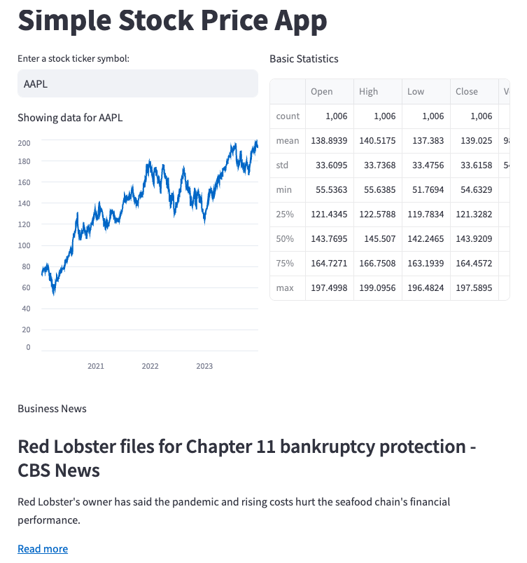

# Simple Stock Price App

This is a simple web application to fetch and display historical stock prices using Streamlit and Yahoo Finance.

## Screenshots



## Features

- User can input a stock ticker symbol.
- Displays historical closing prices of the stock.
- Shows basic statistics of the stock data.

## Installation

1. Clone the repository or download the source code.
2. Navigate to the project directory.

```bash
cd simple-stock-price-app
```

3. Install the required dependencies.

```bash
pip install -r requirements.txt
```

## Running the App

To run the Streamlit app, use the following command:

```bash
streamlit run streamlit_app.py
```

This will start a local server and open the app in your default web browser.

## File Structure

- `streamlit_app.py`: Main Streamlit application script.
- `requirements.txt`: List of dependencies.
- `.streamlit/config.toml`: Configuration file for Streamlit.
- `README.md`: Project overview and instructions.

## Usage

1. Open the app in your web browser.
2. Enter a stock ticker symbol (e.g., `AAPL` for Apple Inc.).
3. View the historical closing prices and basic statistics.


## Contributing

Contributions are welcome! Please open an issue or submit a pull request.

## License

This project is licensed under the MIT License.
